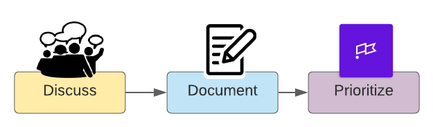

# Triage for Bugs and Fires

> "A bug triage reviews bugs and decides whether and when to fix them. The decision is based on the bug's priority, and factors such as project schedules." - [Wikipedia](https://en.wikipedia.org/wiki/Software_bug#Bug_management)

Bug and fires will happen occasionally and sometimes often. All bugs eventually need to be fixed and all fires eventually need to be put out. A corollary to this is that _not_ all bugs need to be fixed immediately and _not_ all fires need to be put out immediately.

This triage process helps us reduce the amount of disruption to our planned work \(i.e. new features, enhancements, upgrades\) by the inevitable emergence of unplanned work \(i.e bugs and fires\).

Prioritization is the most important aspect of this process. We should _always_ be considering whether the work we're doing at the moment is more or less important than the bugs and fires that appear at any given moment.

## The Triage Process

The process begins when the engineering team becomes aware of a bug or fire via monitoring, user feedback, support team or other some other indicator.

The process proceeds from informal to formal, as many bugs and fires can be resolved with a quick discussion that doesn't necessarily disrupt ongoing work. In fact, this discussion step can reduce the amount of overall time spent on bugs and fires by short-circuiting process to get straight to a solution.

As with most processes, there is always going to be ambiguity. This document is meant to provide guidance, though precisely when and how to use this process is left to the judgement of each individual engineer. 

## Discuss

The first step in triage is to facilitate a discussion to determine the size, severity and impact of and issue. This discussion should include all key stakeholders and knowledgeable parties.

Very often, a resolution can be at this point and nothing else needs to be done other than to fix the issue and move on. Although, you should always be aware of common or trending issues that might indicate a larger underlying problem.

If a quick and immediate resolution cannot be found, the issue needs to be documented!

## Document

If you're discussing an issue and you find yourself saying "I'll have to look at this later" or "I'm not sure when I'll be able to fix this", it's likely time to document the issue as a Story in Shortcut.

Create a story as follows:

* Project: Pick the component where the bug or fire is most significant
* State: Should start out in the backlog until prioritized
* Team: The squad where the work is most likely to be done
* Epic: Bugs and Fires until the story is prioritized
* Iteration: None until the story is prioritized
* Type: Bug
* Requester: The individual\(s\) who care most about resolution
* Owner: The individual most likely to perform the work
* Name: Short, concise and to the point
* Description: Should have enough detail that anyone could easily pick up the work and fix the bug or put out the fire

Once the story has been created, it's time to determine when the work will be done.

## Prioritize

This prioritization step is crucial as a decision is made at this point whether ongoing work ought to be disrupted. This decision should _not_ be taken lightly and only the _most_ urgent bugs and fires should disrupt planned work and only when absolutely necessary.

### Priorities

The priority of a bug or fire is determined on a 4-point scale, with P0 being highest priority and P3 being the lowest. The priority is captured by tagging the story using a Label in Shortcut.

* P0
  * Highest priority, fix immediately
  * Epic: &lt;Squad&gt; &lt; Current Impact Cycle&gt; Bugs and Fires
  * Iteration: Current iteration
  * State: In Development
  * Inform the Squad Leader and Scrum Master that this work is going to be done immediately and will affect planned work
* P1
  * High priority, fix within a few days
  * Epic: &lt;Squad&gt; &lt;Current Impact Cycle&gt; Bugs and Fires
  * Iteration: Current or next iteration
  * State: Backlog or In Development
  * Inform the Squad Leader and Scrum Master that this work is needs to be done very soon so other planned work can be adjusted
* P2
  * Medium priority, fix within a couple weeks
  * Epic: &lt;Squad&gt; Bugs and Fires
  * Iteration: None
  * State: Backlog
  * This is on the backlog and will be planned for a future iteration
* P3
  * Low priority, fix later
  * Epic: &lt;Squad&gt; Bugs and Fires
  * Iteration: None
  * State: Backlog
  * This is on the backlog and will be planned for a future iteration

####  Notes:

* The '&lt;Squad&gt; &lt; Current Impact Cycle&gt; Bugs and Fires' epic is for bugs and fires that are meant to be fixed some time during the current Impact Cycle
* The \`&lt;Squad&gt; Bugs and Fires' epic is for bugs and fires that need to be fixed eventually, but are not yet scheduled
* P0 is a drop everything and fix it event
* P1 is a fix it _very_ soon, but not necessarily today event
* P2 and P3 are fix them later events, with P2 stories being fixed before P3 stories
* All 'Bug' stories _must_ have a priority label: P0, P1, P2 or P3

## FAQ

### If a bug is filed during an Impact Cycle, in which bucket does it belong?

Per the above discussion, the process would look like...

1. Engineering becomes aware of the bug and discusses possible quick fixes \(Discuss\)
2. If it's not a quick fix, a bug story should be created \(Document\)
3. This is where prioritization happens...
   1. The story should be tagged with a priority tag: P0, P1, P2, P3
   2. The epic for the story will be...
      * P0 or P1
        * &lt;Squad&gt; &lt;IC&gt; Bugs and Fires
      * P2
        * &lt;Squad&gt; &lt;IC&gt; Bugs and Fixes if the story needs to be fixed soon, otherwise &lt;Squad&gt; Bugs and Fixes
      * P3
        * &lt;Squad&gt; Bugs and Fixes
   3. The iteration for the story will be...
      * P0
        * The current iteration
      * P1
        * The current or next iteration
      * P2 or P3
        * The next iteration or none

